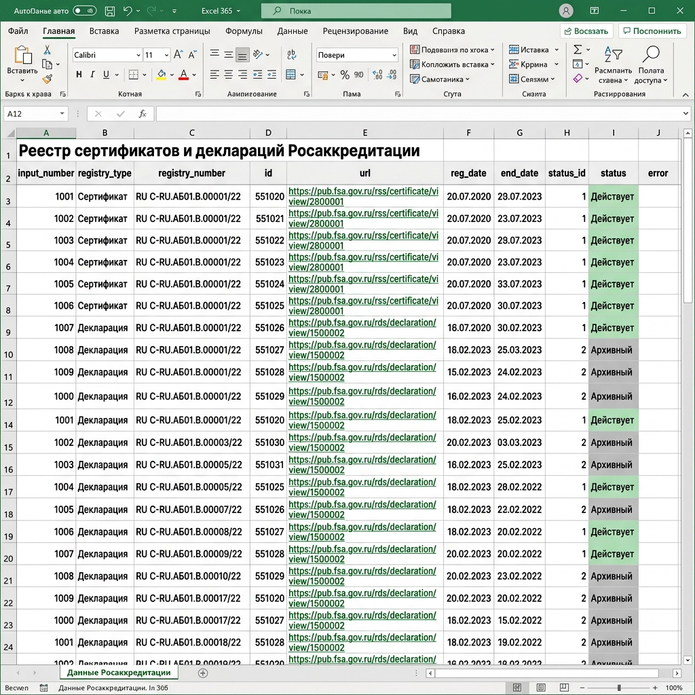

# 🚀 Асинхронный Парсер Реестра Росаккредитации (pub.fsa.gov.ru)

Профессиональное решение для автоматического поиска и выгрузки публичных карточек сертификатов соответствия и деклараций о соответствии по их номерам с официального портала Федеральной службы по аккредитации (ФГИС Росаккредитация).

Парсер работает напрямую с внутренними JSON API сайта, используя анонимные токены авторизации, получаемые через встроенный безголовый (headless) браузер Chromium.

---

## 📊 Результат работы программы (Пример Excel)

Программа формирует чистую, структурированную Excel-таблицу со ссылками на веб-интерфейсы документов и расшифровкой их текущего юридического статуса на русском языке:



---

## 🔥 Ключевые возможности

*   **⚡ Высокая производительность:** Асинхронная архитектура (на базе `httpx` и `asyncio`) позволяет параллельно обрабатывать десятки запросов в несколько потоков.
*   **📂 Поддержка Excel и CSV:** На вход принимаются файлы `.xlsx` и `.csv`. Результат выгружается в структурированный формат `.xlsx` (или `.csv` при необходимости).
*   **🤖 Полная автоматизация авторизации:** Сайт требует JWT-токен (`fgis_token`). Парсер автоматически запускает скрытый браузер через Playwright, извлекает свежий токен из `localStorage`, кэширует его и автоматически обновляет при истечении (обработка ошибок `401`/`403`).
*   **🎨 Умная расшифровка статусов (Status Mapping):** Больше никаких сырых числовых кодов (вроде `6` или `1`) в отчете! Утилита автоматически переводит их в человекочитаемые официальные статусы: **«Действует»**, **«Архивный»**, **«Приостановлен»**, **«Прекращен»**, **«Аннулирован»** и др.
*   **🖱️ Запуск в один клик (Drag-and-Drop и Автосбор) для Windows:** Для нетехнических пользователей создан премиальный файл запуска **`run_parser.bat`**:
    *   **Поиск по списку номеров:** Просто перетащите ваш Excel-файл с номерами документов мышкой на иконку скрипта.
    *   **Автосбор последних документов:** Запустите `run_parser.bat` двойным кликом и нажмите **ENTER**. Парсер автоматически скачает самые свежие зарегистрированные сертификаты и декларации с сайта!
    *   Результат работы в обоих режимах **открывается в Excel автоматически**!

---

## 🛠️ Требования к системе

*   **ОС:** Windows 10 / 11, macOS, Linux
*   **Python:** Версия 3.8 или выше
*   Браузер Chromium (устанавливается автоматически одной командой через Playwright)

---

## ⚙️ Установка и настройка

Откройте терминал (PowerShell или командную строку) в папке проекта и выполните команды:

1.  **Создайте виртуальное окружение Python:**
    ```powershell
    python -m venv .venv
    ```

2.  **Активируйте виртуальное окружение:**
    *   *В Windows (PowerShell):*
        ```powershell
        .\.venv\Scripts\Activate.ps1
        ```
    *   *В Windows (CMD):*
        ```cmd
        .\.venv\Scripts\activate.bat
        ```
    *   *В macOS / Linux:*
        ```bash
        source .venv/bin/activate
        ```

3.  **Установите необходимые библиотеки:**
    ```powershell
    pip install -r requirements.txt
    ```

4.  **Установите фоновый браузер Chromium для авторизации:**
    ```powershell
    python -m playwright install chromium
    ```

---

## 🚀 Как пользоваться парсером

### Вариант 1. Самый простой (через `run_parser.bat` на Windows)
1.  Возьмите ваш файл со списком номеров документов (например, `numbers.xlsx`). 
    *   *Примечание: Номера должны находиться в колонке с заголовком `number` или в самой первой колонке таблицы.*
2.  **Перетащите его мышкой прямо на файл `run_parser.bat`**.
3.  Откроется красивое консольное окно на русском языке, которое покажет процесс.
4.  По окончании работы готовый Excel-отчет **откроется на вашем экране автоматически**!

### Вариант 2. Через командную строку (CLI)
Запустите скрипт вручную с нужными параметрами:
```powershell
.\.venv\Scripts\python main.py --input numbers.xlsx --output result.xlsx
```

**Доступные параметры запуска:**
*   `-i`, `--input` (обязательный) — путь к входному файлу `.xlsx` или `.csv`.
*   `-o`, `--output` (обязательный) — путь к выходному файлу `.xlsx` или `.csv`.
*   `-c`, `--concurrency` (по умолчанию `3`) — количество параллельных потоков запросов к API.
*   `--timeout` (по умолчанию `30.0`) — время ожидания ответа сервера в секундах.
*   `--token` (необязательный) — ручной ввод токена, если вы хотите пропустить автоматический шаг авторизации через браузер.

---

## 📋 Формат выходной таблицы Excel

Итоговый отчет содержит следующие колонки:

*   `Входной номер` — исходный номер документа из вашего входного файла.
*   `Тип документа` — тип найденного документа (`certificate` — сертификат, `declaration` — декларация, и т.д.).
*   `Номер в реестре` — официальный нормализованный номер документа из реестра.
*   `Системный ID` — внутренний уникальный числовой идентификатор записи.
*   `Ссылка на карточку` — **прямая кликабельная веб-ссылка** на публичную карточку документа на сайте Росаккредитации.
*   `Дата регистрации` — дата регистрации документа (YYYY-MM-DD).
*   `Дата окончания действия` — дата окончания срока действия документа.
*   `Код статуса` — внутренний числовой код статуса документа.
*   `Статус` — **расшифрованный статус документа на русском языке** (Действует, Архивный, Приостановлен и т.д.).
*   `Ошибка` — описание ошибки, если при обработке номера произошел сбой.
